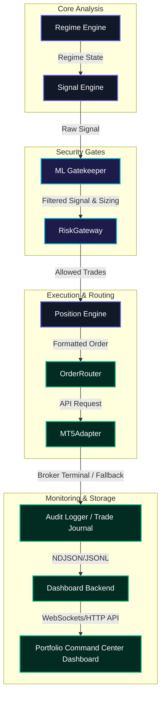

# NowTrading Quant Core V9.3.1 System Map

This document outlines the high-level system architecture and components of the NowTrading Quant Core V9.3.1 institutional trading platform.

## Pipeline Architecture

---

## Component Responsibilities

### 1. Regime Engine (`src/core/regime_engine.py`)
- **Responsibility:** Classifies market conditions (e.g., trend-following or mean-reversion) based on recent price action, ADX indicators, and historical volatility.
- **Role:** Sets the operational bounds for signal generators.

### 2. Signal Engine (`src/core/signal_engine.py`)
- **Responsibility:** Consumes the regime state and latest candle bar ticks to construct setup plans and generate raw directional trading signals (`long` or `short`).
- **Safety Rule:** Cannot interact with the order router or broker terminal directly. All signals must pass through the validation chain.

### 3. ML Gatekeeper (`src/ml/xgb_filter.py`)
- **Responsibility:** Filters signals using a pre-trained XGBoost quality classifier (`xgb_filter.json`). Calculates a quality score between `0.0` and `1.0`.
- **Decisions:** 
  - `BLOCK` (score < 0.55): Signal is discarded.
  - `REDUCE` (score 0.55 - 0.65): Position size is scaled down (default: 50%).
  - `PASS` (score >= 0.65): Signal proceeds at full size.

### 4. Position Engine (`src/core/position_engine.py`)
- **Responsibility:** Calculates exact entry, stop-loss (SL), and take-profit (TP) price levels based on current volatility metrics (ATR multipliers) and symbols config parameters.

### 5. RiskGateway (`src/core/risk_engine.py`)
- **Responsibility:** Acts as the final safety gate prior to execution. Evaluates 7 distinct account and market-level guards (daily loss limit, weekly soft stop, hard drawdown veto, spread limits, slippage limits, ATR shock, and loss streak limits).
- **Veto Power:** Can override any ML or Signal engine action with `SOFT_BLOCK` or `HARD_KILL` decisions.

### 6. OrderRouter (`src/execution/order_router.py`)
- **Responsibility:** Coordinates payload packaging. Dispatches valid, allowed orders to the broker terminal adapter and writes to the execution logs.

### 7. MT5Adapter (`src/execution/mt5_adapter.py`)
- **Responsibility:** Manages the MetaTrader 5 broker terminal connection.
- **Safety Fallback:** If connection fails or terminal is offline, automatically activates **Paper Mock Fallback Mode** to simulate execution locally with realistic fills, preventing broker error crashes.

### 8. Audit Logger (`src/ml/audit_reporter.py` / `src/execution/trade_journal.py`)
- **Responsibility:** Writes all execution decisions, tick parameters, risk actions, and broker responses to immutable log streams (`live_pipeline_audit.ndjson` and `live_journal.jsonl`).

### 9. Dashboard Server (`run_dashboard.py`)
- **Responsibility:** Serves the Portfolio Command Center GUI via HTTP port 8000. Resolves consolidated test outputs and feeds live log feeds and API telemetry.

### 10. Reports (`reports/`)
- **Responsibility:** Consolidated reports directory generated during backtests and training sprints (`realism_engine/summary.json`, `edge_discovery/summary.json`).

---

## Process Automation

### `start_all_bots.bat`
- Launches individual Python processes for all 10 configured symbols in parallel. Runs them in secure `paper/demo` mode by parsing standard environment settings.

### `stop_all_bots.bat`
- Kills all running python.exe bot processes on the system to perform an emergency system halt.
