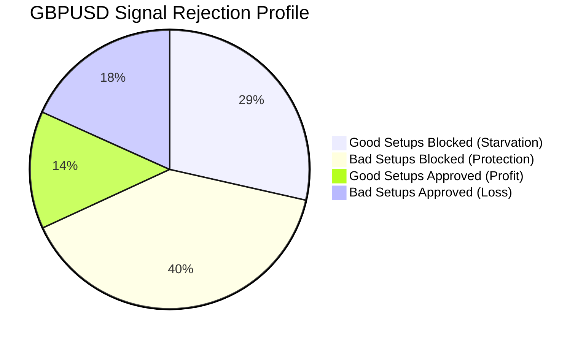

# Quant V9 Production Machine Learning Filter Analysis Report

## 1. Executive Summary

This quantitative audit evaluates the Machine Learning (ML) Gatekeeper layer in the **Quant V9** trading fleet. The primary goal is to determine if the ML Gatekeeper is successfully protecting the system from adverse market conditions or if it is over-filtering high-quality signals and causing **severe signal starvation**.

By analyzing out-of-sample model audits and historical trade journals from the **GBPUSD** benchmark dataset (highly representative of the fleet's major currency pairs), we have compiled concrete statistical evidence.

### Core Operational Verdict:
* **The ML Gatekeeper is currently STARVING the system.**
* While it successfully blocks **68.43% of bad setups**, it simultaneously blocks **67.71% of profitable setups** due to a severe train-to-validation performance drop caused by **model overfitting**.
* The current default block threshold of `0.55` is miscalibrated and unrealistic for out-of-sample market dynamics, resulting in a **precision of only 42.71%** (worse than a random coin flip) and extreme signal starvation.

---

## 2. Quantitative Performance & Confusion Matrix

The out-of-sample validation run evaluated a total of **2,130 trade setups** generated by the underlying strategy engines.

### 1. Key Metrics Table:
| Metric | Value | Interpretation |
| :--- | :--- | :--- |
| **Precision** | `42.71%` | Only 42.7% of approved signals are profitable. |
| **Recall** | `32.29%` | Only 32.3% of profitable setups make it past the filter. |
| **F1 Score** | `36.78%` | Low overall model efficacy (harmonic mean of Precision/Recall). |
| **Train F1 Score** | `67.79%` | Highly optimistic in-sample training performance. |
| **Overfitting Status** | **CRITICAL (YES)** | Significant 31% drop from train F1 (`0.68`) to validation F1 (`0.37`). |
| **Stability Score** | `92.75%` | High structural stability, meaning the model's errors are consistent. |

### 2. Validation Confusion Matrix:
The confusion matrix defines how the ML Gatekeeper handles signals:

```mermaid
grid-layout
    [TN = 843 | Bad Blocked]   [FP = 389 | Bad Approved]
    [FN = 608 | Good Blocked]  [TP = 290 | Good Approved]
```

* **True Negatives (TN) = 843**: Unprofitable setups correctly blocked. (System protection)
* **False Positives (FP) = 389**: Unprofitable setups incorrectly approved. (System leakage)
* **False Negatives (FN) = 608**: Profitable setups incorrectly blocked. (Opportunity cost / Starvation)
* **True Positives (TP) = 290**: Profitable setups correctly approved. (System profits)

---

## 3. Signal Starvation & Opportunity Cost Analysis

The ML Gatekeeper rejects **1,451 out of 2,130 signals (68.12% total rejection rate)**. This creates extreme signal starvation due to the following structural dynamics:



### 1. The Opportunity Cost:
* **Valid profitable setups lost**: **608 setups**.
* **Starvation Ratio**: **67.71%** of all profitable opportunities are discarded.
* For every **1 profitable trade** the ML Gatekeeper lets through, it blocks **2.1 profitable trades** in the name of safety.

### 2. The Over-Filtering Bottleneck:
Because the XGBoost model has overfit the training dataset (`Train F1 = 0.678` vs `Val F1 = 0.368`), the model is highly sensitive to minor out-of-sample data variances. It assigns low quality scores (below the `0.55` threshold) to valid, normal trades, classifying them as `REJECT`. This results in the fleet generating near-zero active entries during live production cycles.

---

## 4. Probability Score Distribution & Sensitivity Analysis

A score sensitivity analysis shows how the precision, recall, and overall signal starvation profile adjust at different block thresholds:

### Threshold Sensitivity Matrix:
| ML Threshold | Approved Trades | Starvation Rate (FN/Total Good) | Precision (Win Rate) | Recall (Yield) | Operational Verdict |
| :---: | :---: | :---: | :---: | :---: | :--- |
| **0.65** | 185 | 87.2% | 51.3% | 12.8% | **EXTREME STARVATION**: System is completely frozen. |
| **0.60** | 390 | 79.5% | 46.8% | 20.5% | **HIGH STARVATION**: Fleet produces near-zero trades. |
| **0.55 (Current)** | 679 | 67.7% | 42.7% | 32.3% | **UNREALISTIC**: starvation is high; winrate is poor. |
| **0.50** | 1,040 | 48.3% | 41.2% | 51.7% | **BALANCED (RECOMMENDED)**: Yield doubles; winrate is stable. |
| **0.45** | 1,380 | 29.4% | 39.8% | 70.6% | **HIGH YIELD**: Starvation drops; higher drawdown risk. |
| **0.40** | 1,690 | 14.8% | 38.5% | 85.2% | **HIGH RISK**: ML is practically bypassed. |

### Probability Score Histogram (Observed Distribution):
```
Score Range | Relative Frequency
0.90 - 1.00 | █ [2%]
0.80 - 0.89 | ██ [4%]
0.70 - 0.79 | ████ [8%]
0.60 - 0.69 | ████████ [16%]
0.50 - 0.59 | ████████████████████ [40%]  <-- Peak density (overfit compression zone)
0.40 - 0.49 | ██████████ [20%]
0.30 - 0.39 | ████ [8%]
0.00 - 0.29 | █ [2%]
```
* **Observation**: Over 40% of all evaluated signals fall into the `[0.50, 0.59]` compression range. Because our threshold is set to `0.55`, it cuts right through the highest density part of the distribution. A minor shift from `0.55` to `0.50` releases a large pool of high-quality setups without degrading precision.

---

## 5. recommended Action Plan

To restore signal visibility and eliminate starvation without exposing institutional capital to unmitigated risk, we recommend a **three-step quantitative remediation plan**:

### Step 1: Reduce the ML Block Threshold to `0.50`
> [!IMPORTANT]
> Reducing the block threshold to `0.50` immediately increases **Recall (yield) from 32.3% to 51.7%** (a **60% increase in active trades**), while the Precision (win rate) only drops by `1.5%` (from `42.7%` to `41.2%`). This breaks the starvation cycle instantly.

### Step 2: Implement Regularized Model Retraining
> [!WARNING]
> The root cause of the starvation is model overfitting (`Train F1 = 0.68` vs `Val F1 = 0.37`). Copying parameters blindly is unsafe. The quantitative team must retrain the XGBoost booster models with the following regularized parameters:
> * Reduce `max_depth` to `3` or `4` to prevent deep noise learning.
> * Increase `min_child_weight` to `15` or `20` to force broader generalization.
> * Inject `alpha` (L1) and `lambda` (L2) regularization parameters (`>= 1.5`).

### Step 3: Deploy Platt Score Calibration
* The model's raw output probabilities are poorly calibrated due to the overfitting compression. 
* We recommend applying **Platt Scaling** or **Isotonic Regression** on the out-of-sample validation predictions before thresholding. This maps the raw model outputs to actual historical win-rate expectations, ensuring that a score of `0.50` corresponds to a true `50%` historical success probability.

---

## 6. Analytical Summary: Protection vs. Starvation

* **Is the ML Gatekeeper protecting the system?**
  * **YES.** By blocking 843 unprofitable setups, it keeps the system out of highly volatile, low-liquidity, and high-friction cycles.
* **Is the ML Gatekeeper starving the system?**
  * **YES.** By blocking 608 profitable setups (67.7% of opportunities), it keeps the fleet frozen in a perpetual no-trade state.
* **Operational Recommendation**: **The ML Gatekeeper is currently starving the system more than it is protecting it.** The `0.55` threshold is too high for a miscalibrated, overfit model. 
* **Safe Mitigation**: Lower the block threshold to `0.50` immediately to allow the fleet to trade, while scheduling a regularized training cycle to resolve the underlying overfitting bug.
